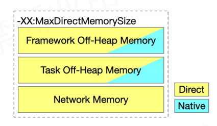

# Flink TaskExecutor内存管理

## 一、 背景

- Flink 1.9及以前版本的TaskExecutor内存模型

  - 逻辑复杂难懂
  - 实际内存大小不确定
  - 不同场景及模块计算结果不一致
  - 批、流配置无法兼容

- Flink 1.10引入了FLIP-49，对TaskExecutor内存模型进行了统一的梳理和简化

- Flink 1.10内存模型：

  

## 二、内存类型及用途

> 左图是Flink1.10设计文档的内存模型图，有图为Flink 官方用户文档内存模型，实际上语义是一样的。

###  Framework 和Task Memory

## 三、内存特性解读

### Java内存类型

很多时候都在说，Flink使用到的内存包括Heap、Direct、Native Memory等，那么Java到底有多少种类型的内存？Java的内存分类是一个比较复杂的问题，但归根究底只有两种内存：Heap与Off-Heap。所谓Heap就是Java堆内存，Off-Heap就是堆外内存。

- Heap

  - 经过JVM虚拟化的内存。
  - 实际存储地址可能随GC变化，上层应用无感知。

  > 一个Java对象，或者一个应用程序拿到一个Java对象之后，它并不需要去关注内存实际上是存放在哪里的，实际上也没有一个固定的地址。

- Off-Heap
  - 未经JVM虚拟化的内存
  - 直接映射到本地OS内存地址

> 1. Java的Heap内存空间实际上也是切分为了Eden、S0、S1、Tenured这几部分，所谓的垃圾回收机制会让对象在Eden空间中，随着Eden空间满了之后会触发GC，把已经没有使用的内存释放掉；已经引用的对象会移动到Servivor空间，在S0和S1之间反复复制，最后会放在老年代内存空间中。 这是Java的GC机制，造成的问题是Java对象会在内存空间中频繁的进行复制、拷贝。
> 2. 所谓的Off-Heap内存，是直接使用操作系统提供的内存，也就是说内存地址是操作系统来决定的。一方面避免了内存在频繁GC过程中拷贝的操作，另外如果涉及到对一些OS的映射或者网络的一些写出、文件的一些写出，它避免了在用户空间复制的一个成本，所以它的效率会相对更高。 
> 3. Heap的内存大小是有-Xmx决定的，而Off-Heap部分：有一些像Direct，它虽然不是在堆内，但是JVM会去对申请了多少Direct Memory进行计数、进行限制。如果设置了-XX：MaxDirectMemorySize的参数，当它达到限制的时候，就不会去继续申请新的内存;同样的对于metaspace也有同样的限制。
> 4. 既不受到Direct限制，也不受到Native限制的，是Native Memory。

- Question：什么是JVM内(外)的内存？

  - 经过JVM虚拟化
    - Heap

  - 受JVM管理
    - 用量上限、申请、释放（GC）等
    - Heap、Direct、Metaspace、even some Native（e.g., Thread Stack）

### Heap Memory特性

在Flink当中，Heap Memory

- 包括 
  - Framework Heap Memory
  - Task Heap Memory
- 用量上限受JVM严格控制
  - -Xmx：Framework Heap + Task Heap
  - 达到上限后触发垃圾回收（GC）
  - GC后仍然空间不足，触发OOM异常并退出
    - OutOfMemoryError: Java heap space

### Direct Memory特性

- 包括：
  - Framework Off-Heap Memory（部分）
  - Task Off-Heap Memory（部分）
  - Network Memory
- 用量上限受JVM严格控制
  - -XX：MaxDirectMemorySize
    - Framework Off-Heap + Task Off-Heap + Network Memory
  - 达到上限时触发GC，GC后仍然空间不足触发OOM异常并退出
    - OutOfMemoryError: Direct buffer memory

### Metaspace特性

- 用量上限受JVM严格控制
  - -XX：MaxMetaspaceSize
  - 达到上限时触发GC，GC后仍然空间不足触发OOM异常并退出
    - OutOfMemoryError: Metaspace

### Native Memory特性

- 包括
  - Framework Off-Heap Memory（小部分）
  - Task Off-Heap Memory（小部分）
  - Managed Memory
  - JVM Overhead
- 用量上限不受JVM严格控制
  - 其中Managed Memory用量上限受Flink严格控制

### Framework / Task Off-Heap Memory

- 既包括Direct也包括Native
- 用户无需理解Direct / Native内存的区别并分别配置
- 无法严格控制Direct内存用量，可能导致超用
- 绝大数情况下
  - Flink框架及用户代码不需要或只需要少量Native内存
  - Heap活动足够频繁，能够及时触发GC释放不需要的Direct内存

> 如果需要大量使用Native内存，可以考虑增大JVM Overhead

## 四、 配置方法

